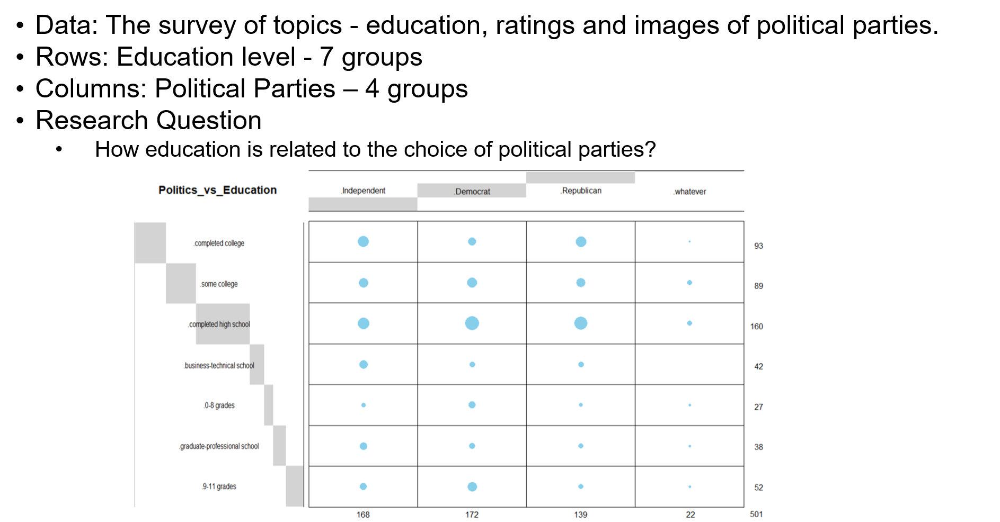
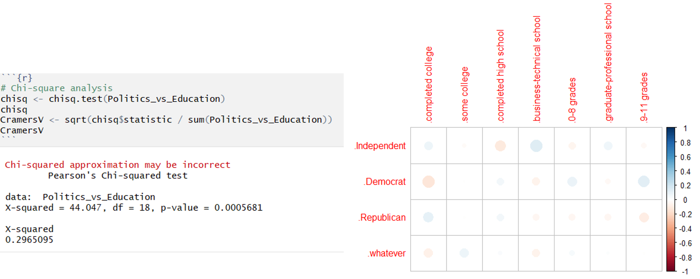
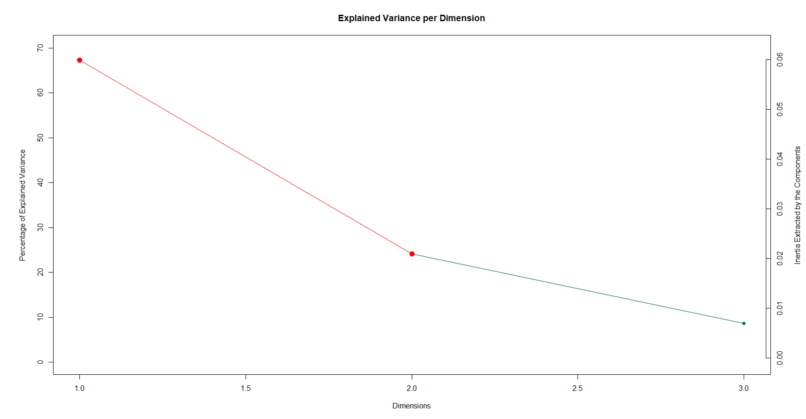
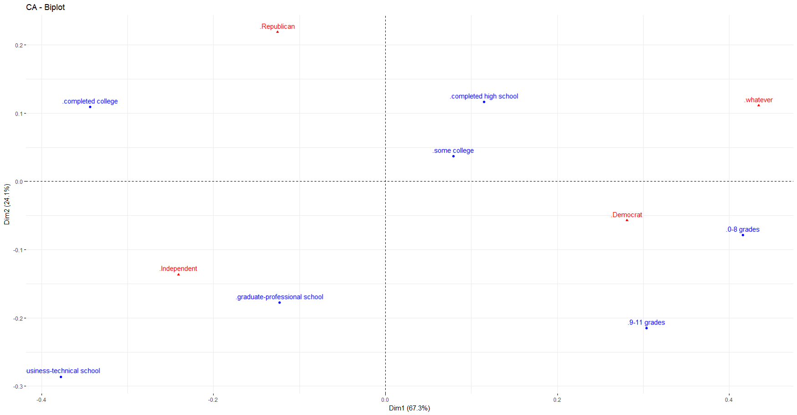
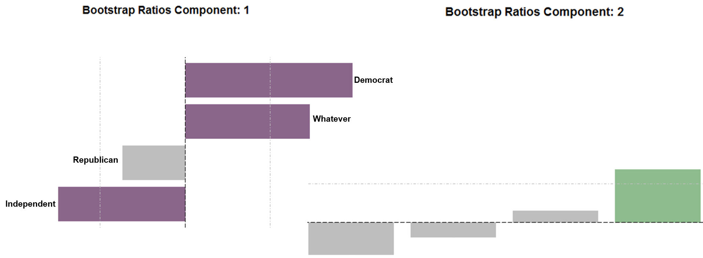

**Bama Politics Data Analysis - Education versus Politics** 

  

Conclusion: 

When we interpret the Biplot and correlation circle plot together, the CA and bootstrap results revealed:

1. Component 1: The latent structure of the Bama Politics data as revealed by CA indicated that the first component characterized Republican & Independent versus Democrat. Also it indicates that educated people prefer Republican & Independent over Democrat.
2. Component 2: Mainly distinguishes people supporting the Republican versus Independent & Democrats.