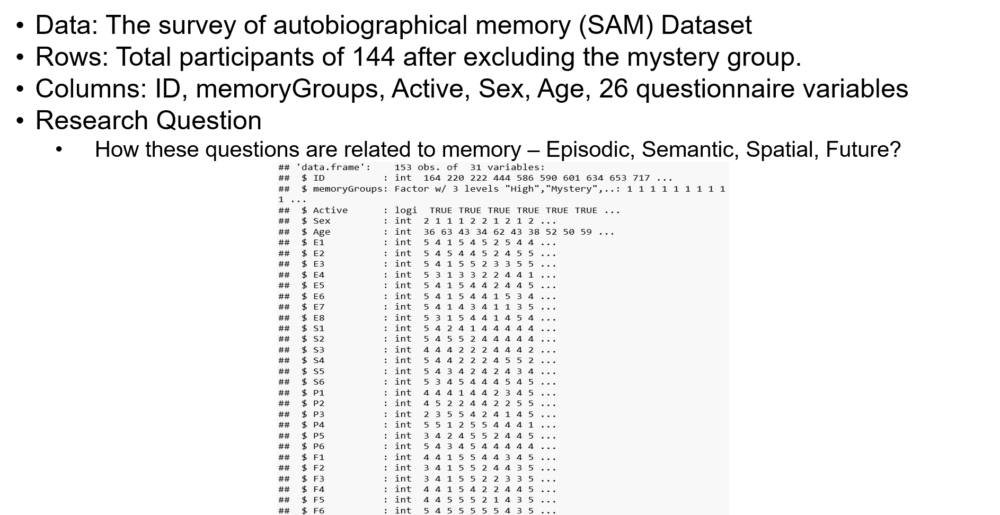
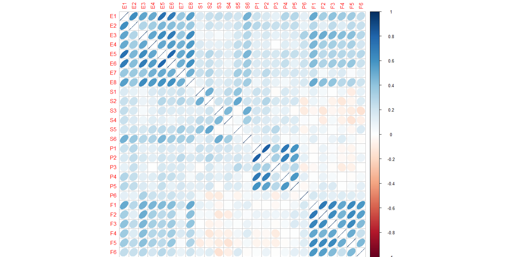
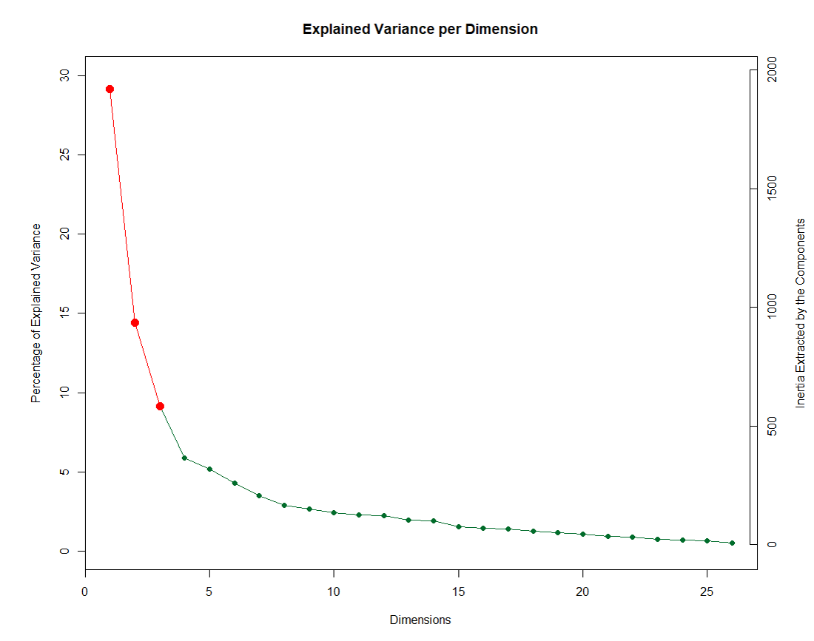
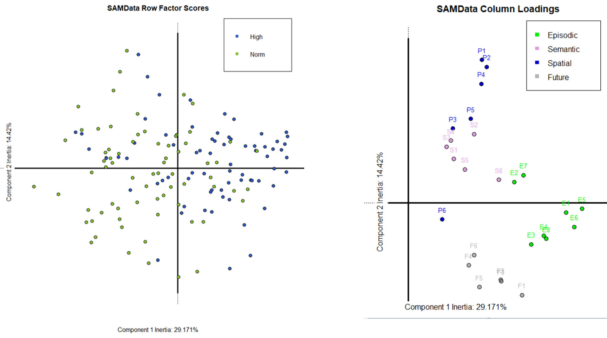
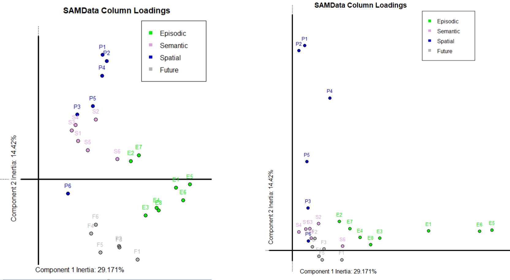
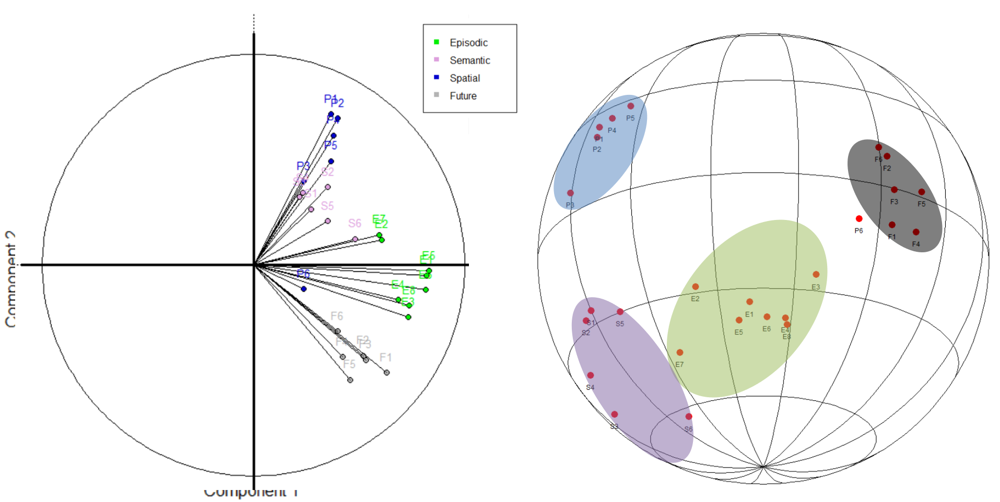
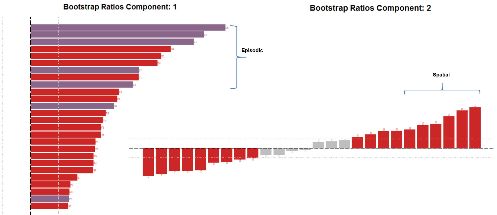

**Survey of Autobiographical Memory - Research Paper Implementation** 

  

Conclusion: 

When we interpret the Biplot and correlation circle plot together, the CA and bootstrap results revealed:

1. Component 1 : Component 1 mainly distinguishes people with high versus normal memory group
1a. Row: Normal versus High Memory group 
1b. Column: Normal versus High Memory scores

2. Component 2
2a. Column: Spatial versus other memory types
2b. Distinguishes questions relating to spatial memory versus other memory types. Also shows negative correlation between spatial and future memory ratings. 